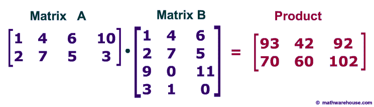

Import numpy and define array and matrix 


```python
# Numpy installed by anaconda 
import numpy as np 

# Check the version of numpy 
np.__version__

# Define array in numpy  
a = np.array([[1,2,3],[4,5,6]])
print(a)

#Define matrix in numpy 
b = np.matrix([[10,20,30],[40,50,60]])
print(b)


```

    [[1 2 3]
     [4 5 6]]
    [[10 20 30]
     [40 50 60]]
    

DType for array :
<br>
int8 = Byte (-128 to 127)
<br>
int16 = Integer (-32768 to 32767)
<br>
int32 = Integer (-2147483648 to +2147483647)
<br>
int64 = Integer (-9223372036854775808 to +9223372036854775807)
<br>
Boolean = (True or False) stored as a byte
<br>
float = Shorthand for float64 : Double precision float: sign bit, 11 bits exponent, 52 bits mantissa
<br>
complex = Shorthand for complex128 : Complex number
<br>
Example : 


```python
# Example for dtype in array 
c = np.array([255,2,3], dtype='int8')
# variable c is between -128 and 127 so 255 show -1 in this type (255-128*2=-1)
print(c)

```

    [-1  2  3]
    

Multipliction
<br>
@ or np.dot :
<br>


```python
A = np.array([[1,4,6,10],[2,7,5,3]])
B = np.array([[1,4,6],[2,7,5],[9,0,11],[3,1,0]])
print(A @ B)
```


    array([[ 93,  42,  92],
           [ 70,  60, 102]])



<br>
<br>
Another way is use of np.dot 
<br>


```python
print(np.dot(A,B))
```

    [[ 93  42  92]
     [ 70  60 102]]
    

 
